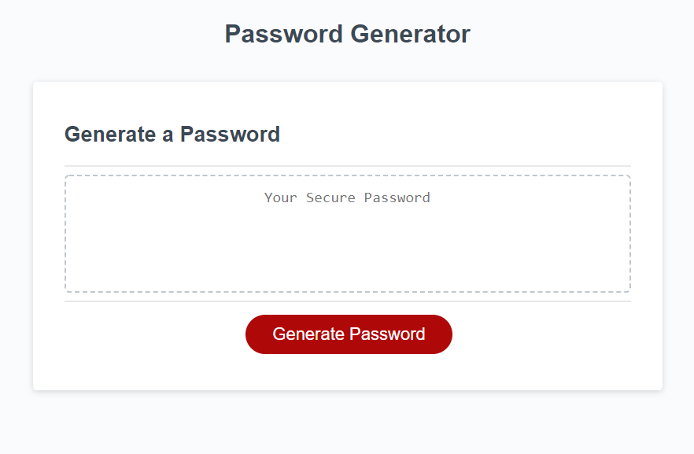

# Password Generator

## Purpose
The purpose of this assignement is to generate a password between 8 to 128 characters.  The characters  
can be uppercase, lowercase, symbols, or numbers.  At least one type of character needs to be selected.

## Built With
* HTML
* CSS
* JavaScript

## Website 
https://amberlyanieto.github.io/password-generator/

![Password Generator]
## Contribution
Stater code given and Amberly Nieto
